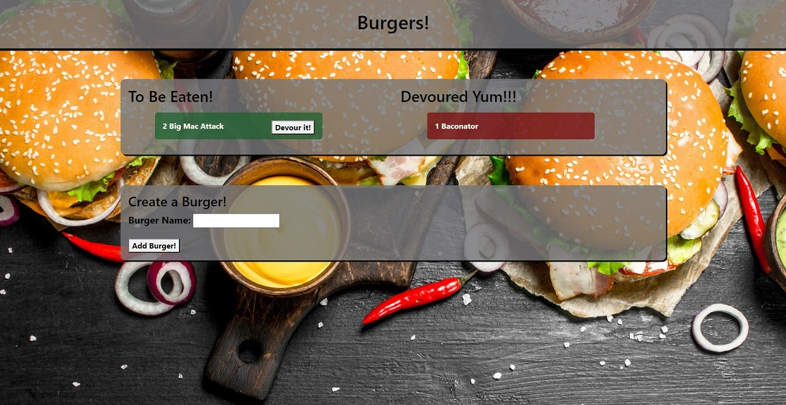

  
  # Burger App

  

  ### [Head to the Burger App here!](https://calm-anchorage-13152.herokuapp.com/)

  

  

  ## Table of Contents
  - [Description](#description)
  - [Installation Instructions](#install)
  - [Usage Information](#usage)
  - [Resources](#resources)
  - [Test](#test)
  - [License](#license)
  - [Questions](#questions)
  
  

  
  ## Description 
  
  A app that utilizes heroku, node, handlebars, and mysql database. Users are presented with a webpage loaded by handlebars that allows them to create and add a burger. Then they can devour it. The burger will move from the available list to the devoured once eaten. Created burgers and eaten burgers are updated to the mysql database.

  ORM stucture is used with the server methods.

  
  
  

  
  ## Installation Instructions 
  
  To run from node / local host, npm i. Also have mysql installed. Make sure to update connection.js with your password and user.
  
  

  
  ## Usage 
  
  On localhost run the server and then go to the localhost:port.

  
  
  To run from Heroku use the provided link.
  Use can add a burger of their making to the available to eat list. It will generate a devour it button allowing it to be clicked and moving it from the available list to the devour list.

  MySQL and JawsDB work with Heroku to put and get data from the database.

  
  
  

  
  ## Resources 
  
  Heroku, Node, Handlebars, MySQL, JawsDB, ORM
  
  

  
  ## Test Information 
  
  None Available
  
  

  
  ## License 
  
  Please refer to the following license for guidelines, usage details, and information.
  
  License: MIT
  
  

  
  ## Questions 
  
  For any questions regarding this material, contact me at the following:
  
  Email: tekhexrax@yahoo.com
  
  Github: [https://github.com/ddsteig](https://github.com/ddsteig)
  
  